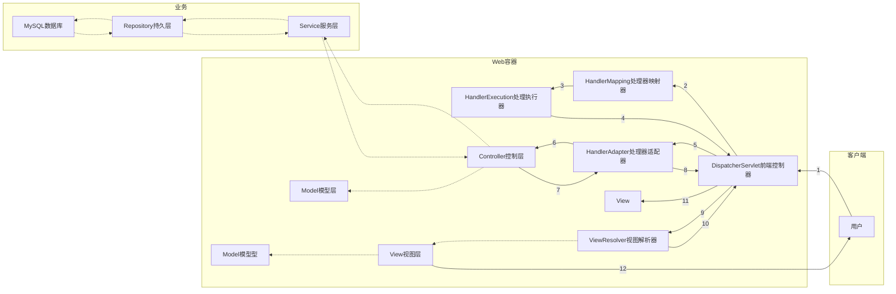

# SpringMVC

官方文档：[Web on Servlet Stack (spring.io)](https://docs.spring.io/spring-framework/docs/current/reference/html/web.html)

## 回顾MVC

### MVC

- MVC是模型(Model)、视图(View)、控制器(Controller)的简写，是一种软件设计规范。
- 是将业务逻辑、数据、显示分离的方法来组织代码。
- MVC主要作用是**降低了视图与业务逻辑间的双向耦合**。
- MVC不是一种设计模式，**MVC是一种架构模式**。当然不同的MVC存在差异。

**Model（模型）：**数据模型，提供要展示的数据，因此包含数据和行为，可以认为是领域模型或JavaBean组件（包含数据和行为），不过现在一般都分离开来：Value Object（数据Dao） 和 服务层（行为Service）。也就是模型提供了模型数据查询和模型数据的状态更新等功能，包括数据和业务。

**View（视图）：**负责进行模型的展示，一般就是我们见到的用户界面，客户想看到的东西。

**Controller（控制器）：**接收用户请求，委托给模型进行处理（状态改变），处理完毕后把返回的模型数据返回给视图，由视图负责展示。也就是说控制器做了个调度员的工作。

**最典型的MVC就是JSP + servlet + javabean的模式。**

### Model1时代

- 在web早期的开发中，通常采用的都是Model1。
- Model1中，主要分为两层，视图层和模型层。

Model1优点：架构简单，比较适合小型项目开发。

Model1缺点：JSP职责不单一，职责过重，不便于维护。

### Model2时代

Model2把一个项目分成三部分，包括**视图、控制、模型。**

Model2这样不仅提高的代码的复用率与项目的扩展性，且大大降低了项目的维护成本。

Model 1模式的实现比较简单，适用于快速开发小规模项目，Model1中JSP页面身兼View和Controller两种角色，将控制逻辑和表现逻辑混杂在一起，从而导致代码的重用性非常低，增加了应用的扩展性和维护的难度。Model2消除了Model1的缺点。

> 流程

1. 用户发请求
2. Servlet接收请求数据，并调用对应的业务逻辑方法
3. 业务处理完毕，返回更新后的数据给servlet
4. servlet转向到JSP，由JSP来渲染页面
5. 响应给前端更新后的页面

> 职责分析

**Controller：控制器**

1. 取得表单数据
2. 调用业务逻辑
3. 转向指定的页面

**Model：模型**

1. 业务逻辑
2. 保存数据的状态

**View：视图**

1. 显示页面

### Servlet

> 新建一个Maven工程当做父工程，添加依赖！

```xml
<dependencies>
   <dependency>
       <groupId>junit</groupId>
       <artifactId>junit</artifactId>
       <version>4.12</version>
   </dependency>
   <dependency>
       <groupId>org.springframework</groupId>
       <artifactId>spring-webmvc</artifactId>
       <version>5.1.9.RELEASE</version>
   </dependency>
   <dependency>
       <groupId>javax.servlet</groupId>
       <artifactId>servlet-api</artifactId>
       <version>2.5</version>
   </dependency>
   <dependency>
       <groupId>javax.servlet.jsp</groupId>
       <artifactId>jsp-api</artifactId>
       <version>2.2</version>
   </dependency>
   <dependency>
       <groupId>javax.servlet</groupId>
       <artifactId>jstl</artifactId>
       <version>1.2</version>
   </dependency>
</dependencies>
```

> 建立一个Moudle ， 添加Web app的支持！

> 导入servlet 和 jsp 的 jar 依赖

```xml
<dependency>
   <groupId>javax.servlet</groupId>
   <artifactId>servlet-api</artifactId>
   <version>2.5</version>
</dependency>
<dependency>
   <groupId>javax.servlet.jsp</groupId>
   <artifactId>jsp-api</artifactId>
   <version>2.2</version>
</dependency>
```

> 编写一个Servlet类，用来处理用户的请求

```java
//实现Servlet接口
public class HelloServlet extends HttpServlet {
   @Override
   protected void doGet(HttpServletRequest req, HttpServletResponse resp) throws ServletException, IOException {
       //取得参数
       String method = req.getParameter("method");
       if (method.equals("add")){
           req.getSession().setAttribute("msg","执行了add方法");
      }
       if (method.equals("delete")){
           req.getSession().setAttribute("msg","执行了delete方法");
      }
       //业务逻辑
       //视图跳转
       req.getRequestDispatcher("/WEB-INF/jsp/hello.jsp").forward(req,resp);
  }

   @Override
   protected void doPost(HttpServletRequest req, HttpServletResponse resp) throws ServletException, IOException {
       doGet(req,resp);
  }
}
```

> 编写Hello.jsp，在WEB-INF目录下新建一个jsp的文件夹，新建hello.jsp

```jsp
<%@ page contentType="text/html;charset=UTF-8" language="java" %>
<html>
<head>
   <title>Kuangshen</title>
</head>
<body>
${msg}
</body>
</html>
```

> 在web.xml中注册Servlet

```xml
<?xml version="1.0" encoding="UTF-8"?>
<web-app xmlns="http://xmlns.jcp.org/xml/ns/javaee"
        xmlns:xsi="http://www.w3.org/2001/XMLSchema-instance"
        xsi:schemaLocation="http://xmlns.jcp.org/xml/ns/javaee http://xmlns.jcp.org/xml/ns/javaee/web-app_4_0.xsd"
        version="4.0">
   <servlet>
       <servlet-name>HelloServlet</servlet-name>
       <servlet-class>com.kuang.servlet.HelloServlet</servlet-class>
   </servlet>
   <servlet-mapping>
       <servlet-name>HelloServlet</servlet-name>
       <url-pattern>/user</url-pattern>
   </servlet-mapping>

</web-app>
```

> 配置Tomcat，并启动测试
>
> - localhost:8080/user?method=add
> - localhost:8080/user?method=delete

**MVC框架要做哪些事情**

1. 将url映射到java类或java类的方法 .
2. 封装用户提交的数据 .
3. 处理请求--调用相关的业务处理--封装响应数据 .
4. 将响应的数据进行渲染 . jsp / html 等表示层数据 .

**说明：**

- 常见的服务器端MVC框架有：Struts、Spring MVC、ASP.NET MVC、Zend Framework、JSF；

- 常见前端MVC框架：vue、angularjs、react、backbone；
- 由MVC演化出了另外一些模式如：MVP、MVVM 等等....

## 基础

### 概述

Spring MVC是Spring Framework的一部分，是基于Java实现MVC的轻量级Web框架。

Spring MVC的特点：

1. 轻量级，简单易学
2. 高效 , 基于请求响应的MVC框架
3. 与Spring兼容性好，无缝结合
4. 约定优于配置
5. 功能强大：RESTful、数据验证、格式化、本地化、主题等
6. 简洁灵活

正因为SpringMVC好 , 简单 , 便捷 , 易学 , 天生和Spring无缝集成(使用Spring IoC和Aop) , 使用约定优于配置 ,能够进行简单的junit测试 .支持Restful风格 ,异常处理 , 本地化 , 国际化 , 数据验证 , 类型转换 , 拦截器 等等......

### 中心控制器

Spring的web框架围绕**DispatcherServlet** [ 调度Servlet ] 设计。

DispatcherServlet的作用是将请求分发到不同的处理器。从Spring 2.5开始，使用Java 5或者以上版本的用户可以采用基于注解的controller声明方式。

Spring MVC框架像许多其他MVC框架一样, **以请求为驱动** , **围绕一个中心Servlet分派请求及提供其他功能**，**DispatcherServlet是一个实际的Servlet (它继承自HttpServlet 基类)**。

### 执行流程

SpringMVC的一个较完整的流程图，实线表示SpringMVC框架提供的技术，不需要开发者实现，虚线表示需要开发者实现。



## 快速开始

### 配置版

>新建Moudle， 添加web的支持，添加SpringMVC 的依赖！
>

> 配置web.xml，注册DispatcherServlet

```xml
<?xml version="1.0" encoding="UTF-8"?><web-app xmlns="http://xmlns.jcp.org/xml/ns/javaee"        xmlns:xsi="http://www.w3.org/2001/XMLSchema-instance"        xsi:schemaLocation="http://xmlns.jcp.org/xml/ns/javaee http://xmlns.jcp.org/xml/ns/javaee/web-app_4_0.xsd"        version="4.0">
   <!--1.注册DispatcherServlet-->   
    <servlet>       
        <servlet-name>springmvc</servlet-name>       
        <servlet-class>org.springframework.web.servlet.DispatcherServlet</servlet-class>       
        <!--关联一个springmvc的配置文件:【servlet-name】-servlet.xml-->       
        <init-param>           
            <param-name>contextConfigLocation</param-name>           
            <param-value>classpath:springmvc-servlet.xml</param-value>       
        </init-param>       
        <!--启动级别-1-->       
        <load-on-startup>1</load-on-startup>   
    </servlet>
   <!--/ 匹配所有的请求；（不包括.jsp）-->  
    <servlet-mapping>       
        <servlet-name>springmvc</servlet-name>       
        <url-pattern>/</url-pattern>   
    </servlet-mapping>
</web-app>
```

> 编写SpringMVC 的 配置文件！名称：springmvc-servlet.xml  : [servletname]-servlet.xml

说明，这里的名称要求是按照官方来的

```xml
<?xml version="1.0" encoding="UTF-8"?><beans xmlns="http://www.springframework.org/schema/beans"      xmlns:xsi="http://www.w3.org/2001/XMLSchema-instance"      xsi:schemaLocation="http://www.springframework.org/schema/beans       http://www.springframework.org/schema/beans/spring-beans.xsd">
</beans>
```

> 添加处理映射器

```xml
<bean class="org.springframework.web.servlet.handler.BeanNameUrlHandlerMapping"/>
```

> 添加处理器适配器

```xml
<bean class="org.springframework.web.servlet.mvc.SimpleControllerHandlerAdapter"/>
```

> 添加视图解析器

```xml
<!--视图解析器:DispatcherServlet给他的ModelAndView-->
<bean class="org.springframework.web.servlet.view.InternalResourceViewResolver" id="InternalResourceViewResolver">   
    <!--前缀-->   
    <property name="prefix" value="/WEB-INF/jsp/"/>   
    <!--后缀-->   
    <property name="suffix" value=".jsp"/>
</bean>
```

> 编写操作业务Controller 

要么实现Controller接口，要么增加注解；需要返回一个ModelAndView，装数据，封视图；

```java
//注意：这里我们先导入Controller接口
public class HelloController implements Controller {
   public ModelAndView handleRequest(HttpServletRequest request, HttpServletResponse response) throws Exception {       
       // ModelAndView 模型和视图      
       ModelAndView mv = new ModelAndView();
       // 封装对象，放在ModelAndView中Model      
       mv.addObject("msg","HelloSpringMVC!");       
       // 封装要跳转的视图，放在ModelAndView中
       // 目标地址：/WEB-INF/jsp/hello.jsp   
       mv.setViewName("hello");     
       return mv;  
   }   
}
```

> 将自己的类交给SpringIOC容器，注册bean

```xml
<!--Handler-->
<bean id="/hello" class="com.javaboy.controller.HelloController"/>
```

> 写要跳转的jsp页面，显示ModelandView存放的数据，以及我们的正常页面

```jsp
<%@ page contentType="text/html;charset=UTF-8" language="java" %>
<html>
    <head>   
        <title>javaboy</title>
    </head>
    <body>${msg}</body>
</html>
```

> 配置Tomcat 启动测试！
>
> http://localhost:8080/hello

### 注解版

> 新建Moudle，添加web支持！

> Maven资源过滤

```xml
<build>   
    <resources>       
        <resource>           
            <directory>src/main/java</directory>           
            <includes>               
                <include>**/*.properties</include>               
                <include>**/*.xml</include>           
            </includes>           
            <filtering>false</filtering>       
        </resource>       
        <resource>           
            <directory>src/main/resources</directory>          
            <includes>               
                <include>**/*.properties</include>               
                <include>**/*.xml</include>           
            </includes>           
            <filtering>false</filtering>       
        </resource>   
    </resources>
</build>
```

> 添加依赖

主要有Spring框架核心库、Spring MVC、servlet , JSTL等。

> 配置web.xml

```xml
<?xml version="1.0" encoding="UTF-8"?><web-app xmlns="http://xmlns.jcp.org/xml/ns/javaee"        xmlns:xsi="http://www.w3.org/2001/XMLSchema-instance"        xsi:schemaLocation="http://xmlns.jcp.org/xml/ns/javaee http://xmlns.jcp.org/xml/ns/javaee/web-app_4_0.xsd"        version="4.0">
   <!--1.注册servlet-->   
    <servlet>       
        <servlet-name>SpringMVC</servlet-name>       
        <servlet-class>org.springframework.web.servlet.DispatcherServlet</servlet-class>       
        <!--通过初始化参数指定SpringMVC配置文件的位置，进行关联-->       
        <init-param>           
            <param-name>contextConfigLocation</param-name>           
            <param-value>classpath:springmvc-servlet.xml</param-value>       
        </init-param>       
        <!-- 启动顺序，数字越小，启动越早 -->       
        <load-on-startup>1</load-on-startup>   
    </servlet>
   <!--所有请求都会被springmvc拦截 -->   
    <servlet-mapping>       
        <servlet-name>SpringMVC</servlet-name>       
        <url-pattern>/</url-pattern>   
    </servlet-mapping>
</web-app>
```

说明：

- 让IOC的注解生效

- 静态资源过滤 ：HTML . JS . CSS . 图片 ， 视频 .....
- MVC的注解驱动
- 配置视图解析器

在视图解析器中我们把所有的视图都存放在/WEB-INF/目录下，这样可以保证视图安全，因为这个目录下的文件，客户端不能直接访问！

> 创建Controller

```java
@Controller
@RequestMapping("/HelloController")
public class HelloController {
   //真实访问地址 : 项目名/HelloController/hello   
    @RequestMapping("/hello")   
    public String sayHello(Model model){       
        //向模型中添加属性msg与值，可以在JSP页面中取出并渲染       
        model.addAttribute("msg","hello,SpringMVC");       
        //WEB-INF/jsp/hello.jsp       
        return "hello";  
    }
}
```

说明：

- @Controller是为了让Spring IOC容器初始化时自动扫描到；
- @RequestMapping是为了映射请求路径，这里因为类与方法上都有映射所以访问时应该是/HelloController/hello；
- 方法中声明Model类型的参数是为了把Action中的数据带到视图中；
- 方法返回的结果是视图的名称hello，加上配置文件中的前后缀变成WEB-INF/jsp/**hello**.jsp。

> 创建视图层

```jsp
<%@ page contentType="text/html;charset=UTF-8" language="java" %>
<html>
    <head>   
        <title>SpringMVC</title>
    </head>
    <body>${msg}</body>
</html>
```

说明：

1. 在WEB-INF/ jsp目录中创建hello.jsp ， 视图可以直接取出并展示从Controller带回的信息；

2. 可以通过EL表示取出Model中存放的值，或者对象；

> 配置Tomcat 启动测试！
>
> http://localhost:8080/HelloController/hello

**小结**

使用springMVC必须配置的三大件：**处理器映射器、处理器适配器、视图解析器**。

通常，我们只需要**手动配置视图解析器**，而**处理器映射器**和**处理器适配器**只需要开启**注解驱动**即可，而省去了大段的xml配置

**/ 和 /\* 的区别：**

`<url-pattern>/</url-pattern>` 不会匹配到`.jsp`， 只针对我们编写的请求；即：`.jsp` 不会进入`Spring`的`DispatcherServlet`类 

`<url-pattern>/* </url-pattern> `会匹配 `*.jsp`，会出现返回 jsp视图 时再次进入`Spring`的`DispatcherServlet`类，导致找不到对应的`controller`所以报`404`错。

## 高级

### RestFul

**所有的地址栏请求默认都会是 HTTP GET 类型的。**

方法级别的注解变体有如下几个组合注解：`@GetMapping`、`@PostMapping`、`@PutMapping`、`@DeleteMapping`、`@PatchMapping`

举个栗子：`@GetMapping` 相当于 `@RequestMapping(method =RequestMethod.GET) `

HTTP Method的历史：

1. HTTP 0.9 这个版本只有`GET`方法
2. HTTP 1.0 这个版本有`GET` `HEAD` `POST`这三个方法
3. HTTP 1.1 这个版本是当前版本，包含`GET` `HEAD` `POST` `OPTIONS` `PUT` `DELETE` `TRACE` `CONNECT`这8个方法

参考资料：[HTTP Method详细解读(`GET` `HEAD` `POST` `OPTIONS` `PUT` `DELETE` `TRACE` `CONNECT`) - 马在路上 - 博客园 (cnblogs.com)](https://www.cnblogs.com/machao/p/5788425.html)

### 结果跳转方式

> ModelAndView

设置ModelAndView对象 , 根据view的名称 , 和视图解析器跳到指定的页面 .

页面 : {视图解析器前缀} + viewName +{视图解析器后缀}

```xml
<!-- 视图解析器 -->
<bean class="org.springframework.web.servlet.view.InternalResourceViewResolver"
     id="internalResourceViewResolver">
   <!-- 前缀 -->
   <property name="prefix" value="/WEB-INF/jsp/" />
   <!-- 后缀 -->
   <property name="suffix" value=".jsp" />
</bean>
```

对应的controller类

```java
public class ControllerTest1 implements Controller {

   public ModelAndView handleRequest(HttpServletRequest httpServletRequest, HttpServletResponse httpServletResponse) throws Exception {
       //返回一个模型视图对象
       ModelAndView mv = new ModelAndView();
       mv.addObject("msg","ControllerTest1");
       mv.setViewName("test");
       return mv;
  }
}
```

> ServletAPI

通过设置ServletAPI , 不需要视图解析器 .

1、通过HttpServletResponse进行输出

2、通过HttpServletResponse实现重定向

3、通过HttpServletResponse实现转发

```java
@Controller
public class ResultGo {

   @RequestMapping("/result/t1")
   public void test1(HttpServletRequest req, HttpServletResponse rsp) throws IOException {
       rsp.getWriter().println("Hello,Spring BY servlet API");
  }

   @RequestMapping("/result/t2")
   public void test2(HttpServletRequest req, HttpServletResponse rsp) throws IOException {
       rsp.sendRedirect("/index.jsp");
  }

   @RequestMapping("/result/t3")
   public void test3(HttpServletRequest req, HttpServletResponse rsp) throws Exception {
       //转发
       req.setAttribute("msg","/result/t3");
       req.getRequestDispatcher("/WEB-INF/jsp/test.jsp").forward(req,rsp);
  }

}
```

> SpringMVC

**通过SpringMVC来实现转发和重定向 - 无需视图解析器；**

测试前，需要将视图解析器注释掉

```java
@Controller
public class ResultSpringMVC {
   @RequestMapping("/rsm/t1")
   public String test1(){
       //转发
       return "/index.jsp";
  }

   @RequestMapping("/rsm/t2")
   public String test2(){
       //转发二
       return "forward:/index.jsp";
  }

   @RequestMapping("/rsm/t3")
   public String test3(){
       //重定向
       return "redirect:/index.jsp";
  }
}
```

**通过SpringMVC来实现转发和重定向 - 有视图解析器；**

重定向 , 不需要视图解析器 , 本质就是重新请求一个新地方嘛 , 所以注意路径问题.

可以重定向到另外一个请求实现 .

```java
@Controller
public class ResultSpringMVC2 {
   @RequestMapping("/rsm2/t1")
   public String test1(){
       //转发
       return "test";
  }

   @RequestMapping("/rsm2/t2")
   public String test2(){
       //重定向
       return "redirect:/index.jsp";
       //return "redirect:hello.do"; //hello.do为另一个请求/
  }

}
```

### 数据处理

> ModelAndView

```java
public class ControllerTest1 implements Controller {

   public ModelAndView handleRequest(HttpServletRequest httpServletRequest, HttpServletResponse httpServletResponse) throws Exception {
       //返回一个模型视图对象
       ModelAndView mv = new ModelAndView();
       mv.addObject("msg","ControllerTest1");
       mv.setViewName("test");
       return mv;
  }
}
```

> ModelMap

```java
@RequestMapping("/hello")
public String hello(@RequestParam("username") String name, ModelMap model){
   //封装要显示到视图中的数据
   //相当于req.setAttribute("name",name);
   model.addAttribute("name",name);
   System.out.println(name);
   return "hello";
}
```

> Model

```java
@RequestMapping("/ct2/hello")
public String hello(@RequestParam("username") String name, Model model){
   //封装要显示到视图中的数据
   //相当于req.setAttribute("name",name);
   model.addAttribute("msg",name);
   System.out.println(name);
   return "test";
}
```

> 对比

- Model 只有寥寥几个方法只适合用于储存数据，简化了新手对于Model对象的操作和理解；

- ModelMap 继承了 LinkedMap ，除了实现了自身的一些方法，同样的继承 LinkedMap 的方法和特性；

- ModelAndView 可以在储存数据的同时，可以进行设置返回的逻辑视图，进行控制展示层的跳转。

> 乱码问题

SpringMVC给我们提供了一个过滤器，配置`web.xml`

```xml
<filter>
   <filter-name>encoding</filter-name>
   <filter-class>org.springframework.web.filter.CharacterEncodingFilter</filter-class>
   <init-param>
       <param-name>encoding</param-name>
       <param-value>utf-8</param-value>
   </init-param>
</filter>
<filter-mapping>
   <filter-name>encoding</filter-name>
   <url-pattern>/*</url-pattern>
</filter-mapping>
```

### 拦截器

SpringMVC的处理器拦截器类似于Servlet开发中的过滤器Filter,用于对处理器进行预处理和后处理。

开发者可以自己定义一些拦截器来实现特定的功能。

> 过滤器与拦截器的区别

过滤器

- servlet规范中的一部分，任何java web工程都可以使用
- 在url-pattern中配置了/*之后，可以对所有要访问的资源进行拦截

拦截器

- 拦截器是AOP思想的具体应用。

- 拦截器是SpringMVC框架自己的，只有使用了SpringMVC框架的工程才能使用
- 拦截器只会拦截访问的控制器方法， 如果访问的是jsp/html/css/image/js是不会进行拦截的

> 自定义拦截器

想要自定义拦截器，必须实现 HandlerInterceptor 接口

```java
public class MyInterceptor implements HandlerInterceptor {

   //在请求处理的方法之前执行
   //如果返回true执行下一个拦截器
   //如果返回false就不执行下一个拦截器
   public boolean preHandle(HttpServletRequest httpServletRequest, HttpServletResponse httpServletResponse, Object o) throws Exception {
       System.out.println("------------处理前------------");
       return true;
  }

   //在请求处理方法执行之后执行
   public void postHandle(HttpServletRequest httpServletRequest, HttpServletResponse httpServletResponse, Object o, ModelAndView modelAndView) throws Exception {
       System.out.println("------------处理后------------");
  }

   //在dispatcherServlet处理后执行,做清理工作.
   public void afterCompletion(HttpServletRequest httpServletRequest, HttpServletResponse httpServletResponse, Object o, Exception e) throws Exception {
       System.out.println("------------清理------------");
  }
}
```

在springmvc的配置文件中配置拦截器

```xml
<!--关于拦截器的配置-->
<mvc:interceptors>
   <mvc:interceptor>
       <!--/** 包括路径及其子路径-->
       <!--/admin/* 拦截的是/admin/add等等这种 , /admin/add/user不会被拦截-->
       <!--/admin/** 拦截的是/admin/下的所有-->
       <mvc:mapping path="/**"/>
       <!--bean配置的就是拦截器-->
       <bean class="com.javaboy.interceptor.MyInterceptor"/>
   </mvc:interceptor>
</mvc:interceptors>
```

