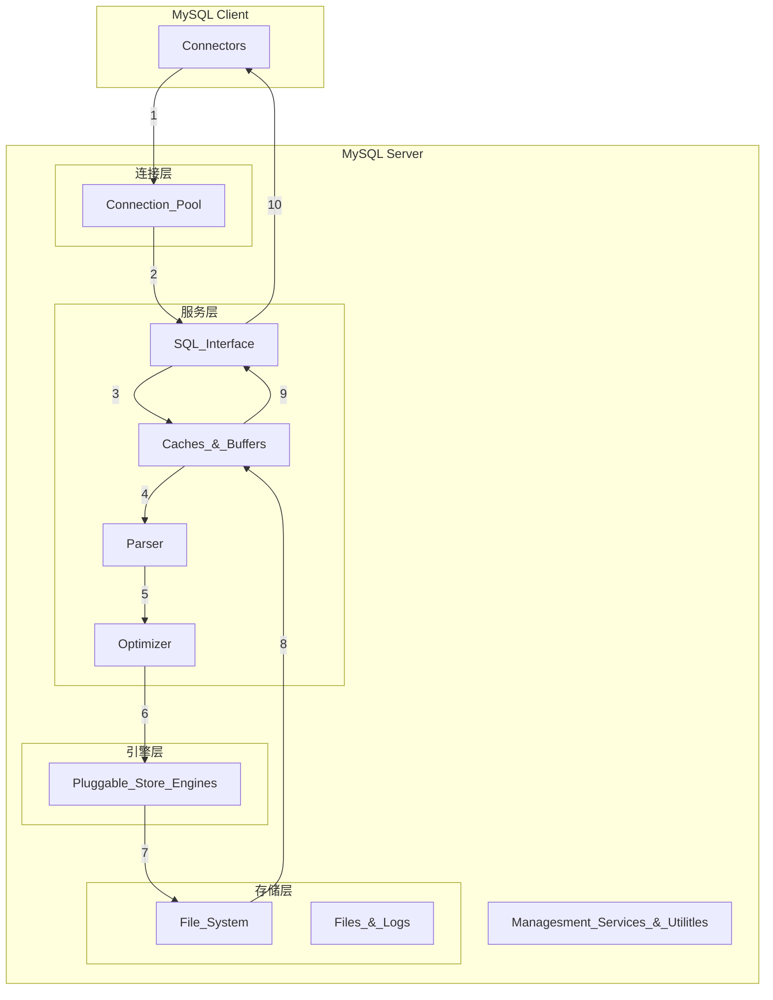

# MySQL

官网地址：[MySQL](https://www.mysql.com/)

大学课程：数据库概论

一刷宋红康：https://www.bilibili.com/video/BV1iq4y1u7vj

课时：`5145`分钟

课程资料：`链接: https://pan.baidu.com/s/1Y1q5ENfgAUmwUwVp0AXO5Q 提取码: 9jds`

二刷狂神说：https://www.bilibili.com/video/BV1NJ411J79W

课时：`715*2=1430`分钟

## MySQL底层结构



Connectiors：MySQL服务器之外得客户端程序

Managesment Services & Utilitles：基础服务组件

Connection Pool：连接池，提供了多个用于客户端与服务器端之间得连接

SQL Interface：SQL接口，接收SQL指令，返回查询结果

Caches & Buffers：查询缓存，以key-value的方式缓存查询结果

Parser：解析器，语法模板，语法解析和生成语法树

Optimizer：优化器，核心组件，对SQL进行优化

Pluggable Store Engines：插件式的存储引擎，与底层的文件系统进行交互

File System：文件系统

Files & Logs：日志文件

## 性能分析工具

查看系统性能参数

统计SQL的查询成本

定位执行慢的SQL：慢查询日志

EXAPIN工具

## 备份

物理备份：`xtrabckup`

逻辑备份：`mysqldump`

```sql
mysqldump -uroot -p server_boot>server_boot.sql
```

数据恢复

```sql
mysql -uroot -p [dbname] < backup.sql
```

## 创建索引

### 适合创建索引

1. 字段的数值有唯一值的限制
2. 频繁作为`where`查询条件的字段
3. 经常`group by`和`order by`的字段
4. `update`和`delete`的`where`条件列
5. `distinct`字段需要创建索引
6. 多表`join`连接操作时，创建索引注意事项
   1. 连接的数量尽量不要超过三张
   2. 对where条件创建索引
   3. 对用于连接的字段创建索引，并且该字段在多张表中国类型必须一致
7. 使用列的类型小的创建索引
8. 使用字符串前缀创建索引
9. 区分度高/散列性高的列适合作为索引
10. 使用最频繁的列放到联合索引的左侧
11. 在多个字段都要创建索引的情况下，联合索引优于单值索引

### 不适合创建索引的情况

1. 在where中使用不到的字段，不要设置索引
2. 数据量小的表最好不要使用索引
3. 有大量重复数据的列上不要建立索引
4. 避免对经常更新的表创建过多的索引
5. 不建议用无序的值作为索引
6. 删除不再使用或者很少使用的索引
7. 不要定义冗余或重复的索引

# MVCC

多版本并发控制

### 快照读与当前读

MVCC的实现依赖于：

- 隐藏字段
  - 【row_id 行id】
  - trx_id 事务id
  - roll_pointer 回滚指针
- Undo Log（多版本）
- Read View（控制）
