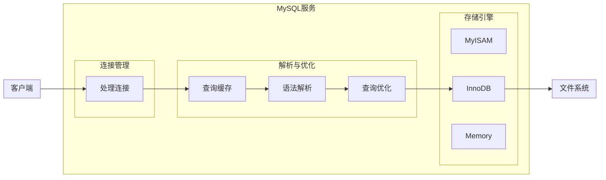
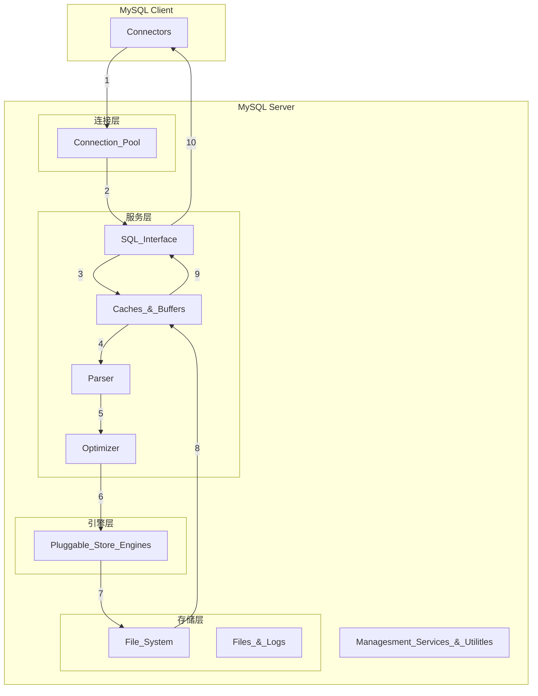
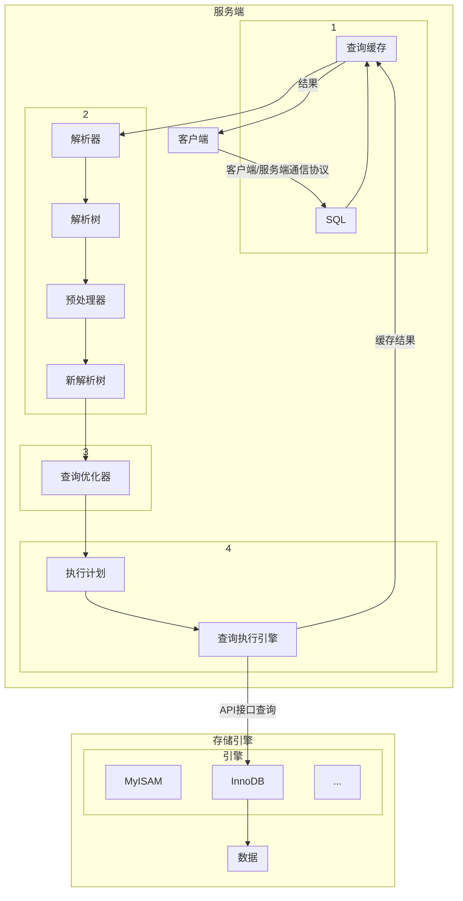
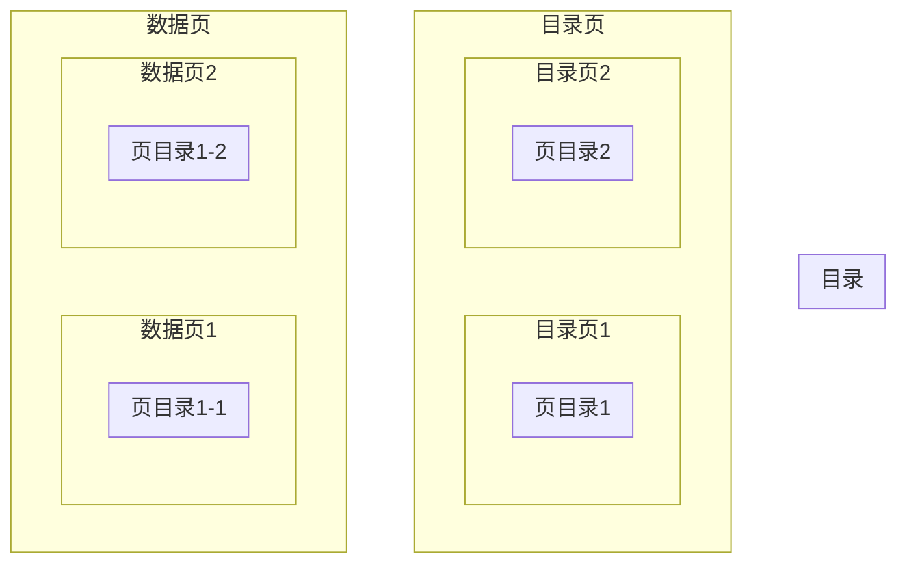

# MySQL

## MySQL基础篇

### 数据库Database

创建数据库:

```sql
create database if not exists db2022;
```

删除数据库:

```sql
drop database if exists db2022;
```

使用数据库:

```sql
use db2022;
```

查询数据库：

```sql
# 查看所有的数据库
show databases;
```

### 表Table

```sql
CREATE TABLE <表名> ([表定义选项])[表选项][分区选项];
```

### 视图View

```sql
CREATE VIEW <视图名> AS <SELECT语句>
```

### 存储过程Procedure

```sql
# 定义分割符
DELIMITER $$
# 创建存储过程
CREATE PROCEDURE my_procedure()
# 开始
BEGIN
	# 过程体
	select * from my_table;
# 结束
END $$
# 还原分隔符
DELIMITER ;

--- 
# 调用
call my_procedure();
```

### 存储函数Function

```sql
# 定义分割符
DELIMITER $$
# 创建存储函数
CREATE PROCEDURE my_Function()
# 开始
BEGIN
	# 声明变量
	# 函数体
	select * from my_table;
# 结束
END $$
# 还原分隔符
DELIMITER ;

--- 
# 调用
select my_Function();
```

### 触发器Trigger

```sql
CREATE my_trigger 
< BEFORE | AFTER > <INSERT | UPDATE | DELETE >
ON my_table 
FOR EACH Row
select * from my_table;
```

### 事件Event

```sql
# 创建触发器
CREATE EVENT Event_Stat_Daily
# 执行时间
ON SCHEDULE EVERY 1 DAY STARTS '2022-08-27 02:00:00'
# 判断event时间是否到期
ON COMPLETION PRESERVE
# 可执行的
ENABLE
# 执行存储过程
DO call my_procedure();
```

## MySQL高级篇

### MySQL架构篇

**MySQL逻辑架构：**



**经典架构详解：**



说明：

- Connectiors：MySQL服务器之外的客户端程序

- Managesment Services & Utilitles：基础服务组件

- Connection Pool：连接池，提供了多个用于客户端与服务器端之间得连接

- SQL Interface：SQL接口，接收SQL指令，返回查询结果

- Caches & Buffers：查询缓存，以key-value的方式缓存查询结果

- Parser：解析器，语法模板，语法解析和生成语法树

- Optimizer：优化器，核心组件，对SQL进行优化

- Pluggable Store Engines：插件式的存储引擎，与底层的文件系统进行交互

- File System：文件系统

- Files & Logs：日志文件

**MQL执行流程：**



### 索引及调优篇

索引是存储引擎用于快速找到数据记录的一种数据结构。

> 推演



说明：

- 数据与数据之间是单向链表，页与页之间是双向链表
- 表头类型：0普通是数据项，1目录项，2最小值，3最大值

> B+Tree

- 每一个节点都是数据页，叶子节点存放的是真实数据，非叶子节点都是目录页
- 数据之间是通过单向链表连接，叶子节点之间是通过双向链表连接

- 一般情况下，用到的B+Tree数都不会超过4层：
  - B+Tree规定叶子节点那层为第0层
  - B+Tree只有1层，最多能存放100条记录
  - B+Tree有2层，最多能存放1000000条记录
  - B+Tree有3层，最多能存放1000000000条记录
  - B+Tree有4层，最多能存放1000000000000条记录

> 索引

索引按照物理实现方式，索引可以分为2种：

- 聚簇（聚集）索引
- 非聚簇（非聚集）索引，同时也称二级索引或者辅助索引

> 注意事项

- 根页面位置万年不动
- 内节点中目录项记录的唯一性
- 一个页面最少存储2条记录

### MySQL事务篇


### 日志与备份篇
